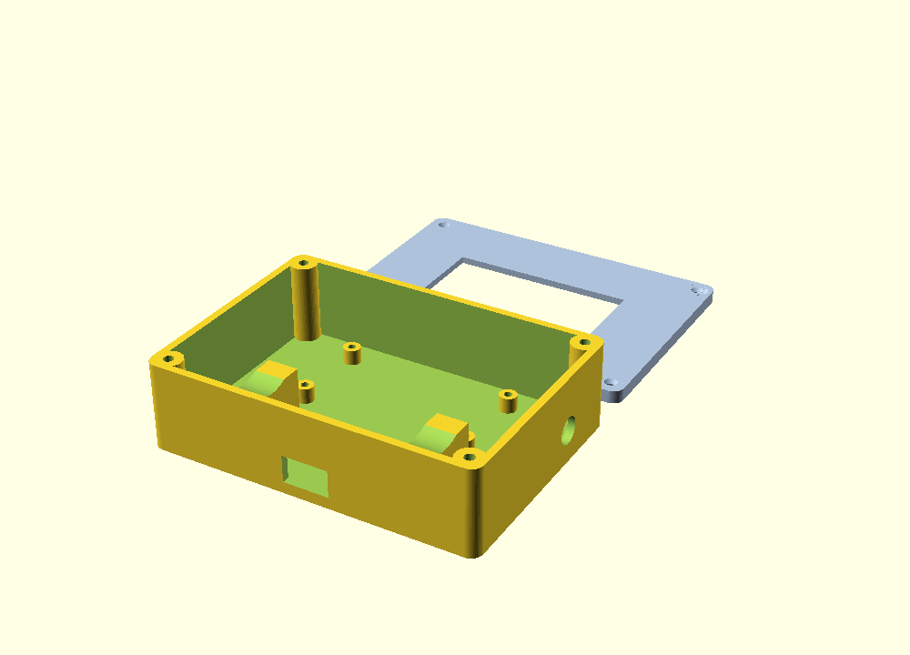

# Enclosure + battery — ESP32 e-paper weather display

A two-part 3D-printed case that houses the ESP32, the 2.13" e-paper module, an
18650 cell, and a **load-sharing** charger so the unit runs on battery and
recharges over USB *while still running*.



Files:
- [`epaper-case.scad`](epaper-case.scad) — parametric source (edit the dims to fit your parts)
- `epaper-case-shell.stl` — the body (electronics + battery)
- `epaper-case-front.stl` — the front plate / display bezel

---

## Power: 18650 + load-sharing charger

> ⚠️ **Why not a bare TP4056?** A plain TP4056 module is *not* load-sharing —
> running the ESP32 off the cell while the TP4056 charges it confuses the charge
> termination and stresses the battery. Use a module with real load sharing /
> power-path (below).

**Recommended — Adafruit PowerBoost 1000C** (cleanest): a LiPo/Li-ion charger +
5 V boost with **true load sharing** — you can power the load while it charges.

**Budget — IP5306 power-bank module** (~$3, includes an 18650 holder): charges
over USB and outputs a boosted 5 V with pass-through. It auto-shuts-off below
~45 mA, but the ESP32 with Wi-Fi active draws well above that, so it stays on.

### Bill of materials
| Qty | Part |
|----|------|
| 1 | ESP32 DevKit V1 (already have) |
| 1 | 2.13" SSD1680 e-paper module (already have) |
| 1 | **Load-sharing charger** — Adafruit PowerBoost 1000C *or* IP5306 module |
| 1 | 18650 cell, protected, 2500–3500 mAh |
| 1 | 18650 holder (if not on the charger module) |
| 1 | SPST slide/rocker switch (optional, fits the side hole) |
| 4 | M2.5 × 8 mm self-tapping screws (corners) |
| — | Hookup wire, heat-shrink |

### Wiring
```
  18650 (+) ──► BAT+ ┐
  18650 (−) ──► BAT− ┤  [ load-sharing charger ]   USB ◄── charge here
                     │
                  5V OUT ──► ESP32  VIN     (5 V pin)
                  GND    ──► ESP32  GND
```
- Charge through the **charger module's** USB port (routed to the case's bottom
  slot) — *not* the ESP32's USB.
- Optional: put the SPST switch in the **5 V OUT** line (or the module's EN pin)
  and mount it in the side hole.
- The firmware needs no changes — it just sees 5 V on VIN like before.

### Runtime
A ~3000 mAh cell at ~100–150 mA average (ESP32 + Wi-Fi is the main draw; the
e-paper only sips during refreshes), through a boost converter at ~85%, gives
roughly **12–18 hours** per charge. The always-on web server prevents deep
sleep, so that's the trade-off for being instantly reachable. Want days instead
of hours? That needs a deep-sleep architecture (and giving up the live server).

> Li-ion safety: use a **protected** cell or a module with DW01 protection, never
> short the terminals, charge only via the module's USB, and watch the first
> charge.

---

## Printing

| Setting | Value |
|---|---|
| Material | PLA or PETG |
| Layer height | 0.2 mm |
| Walls / perimeters | 3 |
| Infill | 20% |
| Supports | **None needed** — print each part flat (open side up) |
| Orientation | shell: cavity up · front: visible face down on the bed |

Both parts print without supports. The corner countersinks on the front plate
come out cleanest with the bezel face on the build plate.

### Re-render the STLs after editing
```
openscad -D 'part="shell"' -o epaper-case-shell.stl epaper-case.scad
openscad -D 'part="front"' -o epaper-case-front.stl epaper-case.scad
```

---

## Assembly
1. **Measure & re-fit:** the `.scad` defaults are typical, not exact. Measure your
   display module, ESP32, holder, and charger, update the variables at the top of
   `epaper-case.scad`, and re-render. `tol` (0.4 mm) tunes press-fit snugness.
2. Seat the **e-paper module** face-down into the front plate's pocket (the
   window lip retains it).
3. Mount the **ESP32** on the four standoffs (self-tap M2 or a dab of hot glue).
4. Drop the **18650 holder/charger** onto the cradle saddles; route the USB port
   to the bottom slot and the optional switch to the side hole.
5. Wire per the diagram, tuck the ribbon/wires, and screw the **front plate** to
   the four corner posts with M2.5 × 8 mm screws.

---

## Customizing `epaper-case.scad`
Every dimension is a labeled variable at the top (display, ESP32, 18650, charger,
ports, screws). Common tweaks:
- `tol` — looser/tighter fits.
- `win_w` / `win_h` / `win_dx` / `win_dy` — match & position the visible window to
  your panel's active area.
- `sw_d = 0` — omit the switch hole.
- `batt_l` / `cell_d` — match your holder and cell.
- `wall`, `fillet` — wall thickness and corner softness.
